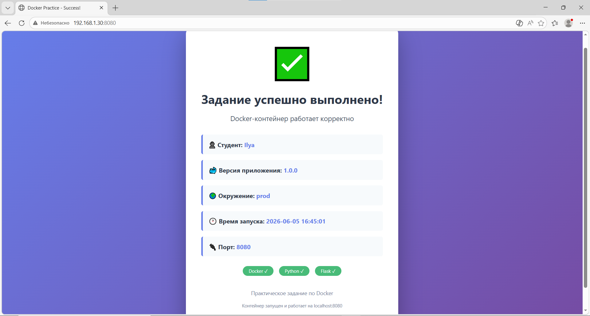

# Python App

---

## Dockerfile

```dockerfile
FROM python:3.11-slim
LABEL maintainer="Linus Torvalds" description="This is description" version="1.0.0"
ENV PYTHONDONTWRITEBYTECODE=1 PYTHONUNBUFFERED=1 APP_VERSION=1.0.0 ENVIRONMENT=prod STUDENT_NAME=Ilya
WORKDIR /app
COPY . .
RUN apt-get update && \
    apt-get install -y --no-install-recommends gcc && \
    pip install --no-cache-dir --upgrade pip && \
    pip install --no-cache-dir -r requirements.txt && \
    apt-get purge -y --auto-remove gcc && \
    apt-get clean && \
    rm -rf /var/lib/apt/lists/* && \
    groupadd -g 1001 usergroup && \
    useradd -u 1001 -g usergroup user && \
    chown -R 1001:1001 /app
HEALTHCHECK --interval=30s --timeout=3s --start-period=5s --retries=3 \
    CMD python -c "import urllib.request; urllib.request.urlopen('http://localhost:8080/health')" || exit 1
USER 1001
EXPOSE 8080
CMD ["python", "app.py"]
```

---

## Переменные окружения (ENV) и метки (LABEL)

```bash
docker inspect python-app --format='{{json .Config}}'
```

```json
{
	"Hostname": "de67788fd8ec",
	"Domainname": "",
	"User": "1001",
	"AttachStdin": false,
	"AttachStdout": false,
	"AttachStderr": false,
	"ExposedPorts": {
		"8080/tcp": {}
	},
	"Tty": false,
	"OpenStdin": false,
	"StdinOnce": false,
	"Env": [
		"PATH=/usr/local/bin:/usr/local/sbin:/usr/local/bin:/usr/sbin:/usr/bin:/sbin:/bin",
		"LANG=C.UTF-8",
		"GPG_KEY=A035C8C19219BA821ECEA86B64E628F8D684696D",
		"PYTHON_VERSION=3.11.15",
		"PYTHON_SHA256=272179ddd9a2e41a0fc8e42e33dfbdca0b3711aa5abf372d3f2d51543d09b625",
		"PYTHONDONTWRITEBYTECODE=1",
		"PYTHONUNBUFFERED=1",
		"APP_VERSION=1.0.0",
		"ENVIRONMENT=prod",
		"STUDENT_NAME=Ilya"
	],
	"Cmd": [
		"python",
		"app.py"
	],
	"Healthcheck": {
		"Test": [
			"CMD-SHELL",
			"python -c \"import urllib.request; urllib.request.urlopen('http://localhost:8080/health')\" || exit 1"
		],
		"Interval": 30000000000,
		"Timeout": 3000000000,
		"StartPeriod": 5000000000,
		"Retries": 3
	},
	"Image": "python-app",
	"Volumes": null,
	"WorkingDir": "/app",
	"Entrypoint": null,
	"OnBuild": null,
	"Labels": {
		"description": "This is description",
		"maintainer": "Linus Torvalds",
		"version": "1.0.0"
	}
}
```
---

## Статус контейнера

```bash
docker ps
CONTAINER ID   IMAGE                    COMMAND                  CREATED          STATUS                    PORTS                                       NAMES
de67788fd8ec   python-app               "python app.py"          22 minutes ago   Up 22 minutes (healthy)   0.0.0.0:8080->8080/tcp, :::8080->8080/tcp   python-app
```
---

## Результат в браузере

