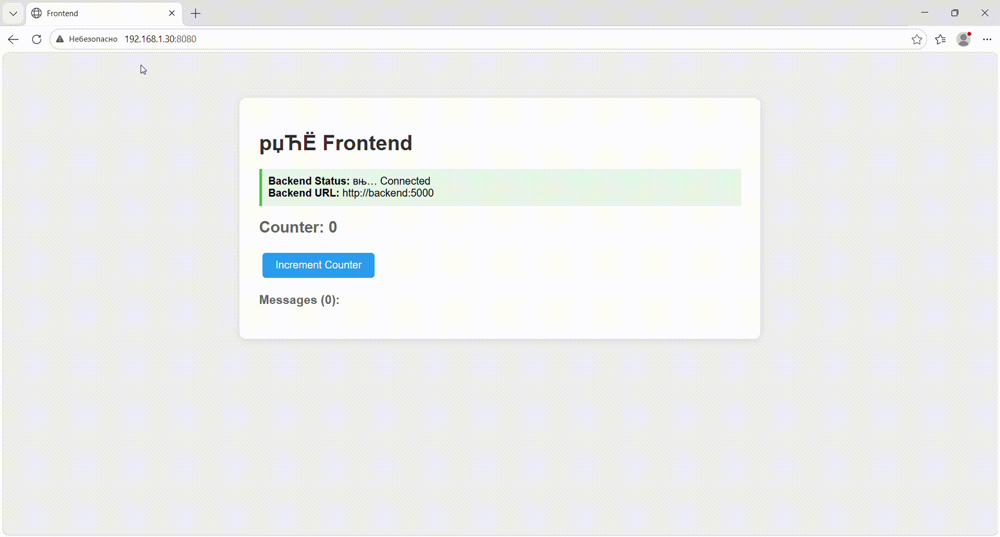

## Docker Compose с нуля

### Задание
Автоматизировать запуск трех контенеров: db, backend, frontend.

### Возникшие проблемы

1. dockerfile backend`a содержал код программы. Пришлось его написать.
2. так как в образах для frontend и backend нет curl или wget то healthcheck использует urllib.request.urlopen() из python
3. что бы приложение работало пришлось добавить ещё один сервис для проксирования запросов в сеть контейнеров и доработать метод fetch() на frontend. Без прокси запросы из браузера пытаются стучаться по внутренним именам docker сети, соответсвенно в консоли бразуера получаем ошибку ERR_NAME_NOT_RESOLVED

### Итог
docker-compose.yml
```yml
version: '3.8'

services:
  db:
    image: postgres:15-alpine
    environment:
      POSTGRES_PASSWORD: postgres
      POSTGRES_USER: postgres
      POSTGRES_DB: prod
    volumes:
      - ./db/init.sql:/docker-entrypoint-initdb.d/init.sql
      - pgdata:/var/lib/postgresql/data
    healthcheck:
      test: ["CMD-SHELL", "pg_isready -U ${POSTGRES_USER} -d ${POSTGRES_DB}"]
      interval: 10s
      timeout: 5s
      retries: 5
    networks:
      - app-network
  backend:
    build: ./backend
    environment:
      APP_NAME: Backend
      DB_HOST: db
      DB_PORT: 5432
    depends_on:
      - db
    healthcheck:
      test: ["CMD-SHELL", "python -c \"import urllib.request; urllib.request.urlopen('http://localhost:5000')\" || exit 1"]
      interval: 10s
      timeout: 5s
      retries: 3
    networks:
      - app-network
  frontend:
    build: ./frontend
    environment:
      APP_NAME: Frontend
      BACKEND_URL: http://backend:5000
    depends_on:
      - backend
    healthcheck:
      test: ["CMD-SHELL", "python -c \"import urllib.request; urllib.request.urlopen('http://localhost:8080')\" || exit 1"]
      interval: 30s
      timeout: 10s
      retries: 3
    networks:
      - app-network
  nginx:
    image: nginx:alpine
    container_name: proxy
    networks:
      - app-network
    depends_on:
      - frontend
    ports:
      - 8080:80
    volumes:
      - ./nginx/default.conf:/etc/nginx/conf.d/default.conf

volumes:
  pgdata:
networks:
  app-network:
    driver: bridge

```
Healthcheck работает:
``` bash
docker-compose ps -a
WARN[0000] The "POSTGRES_USER" variable is not set. Defaulting to a blank string.
WARN[0000] The "POSTGRES_DB" variable is not set. Defaulting to a blank string.
WARN[0000] /root/pdo/practice/docker/practice 4/docker-compose.yml: the attribute `version` is obsolete, it will be ignored, please remove it to avoid potential confusion
NAME                   IMAGE                COMMAND                  SERVICE    CREATED          STATUS                             PORTS
practice4-backend-1    practice4-backend    "python app.py"          backend    29 seconds ago   Up 29 seconds (healthy)            5000/tcp
practice4-db-1         postgres:15-alpine   "docker-entrypoint.s…"   db         29 seconds ago   Up 29 seconds (healthy)            5432/tcp
practice4-frontend-1   practice4-frontend   "python app.py"          frontend   29 seconds ago   Up 29 seconds (health: starting)   8080/tcp
proxy                  nginx:alpine         "/docker-entrypoint.…"   nginx      29 seconds ago   Up 29 seconds                      0.0.0.0:8080->80/tcp, [::]:8080->80/tcp
```


Приложение работает:

